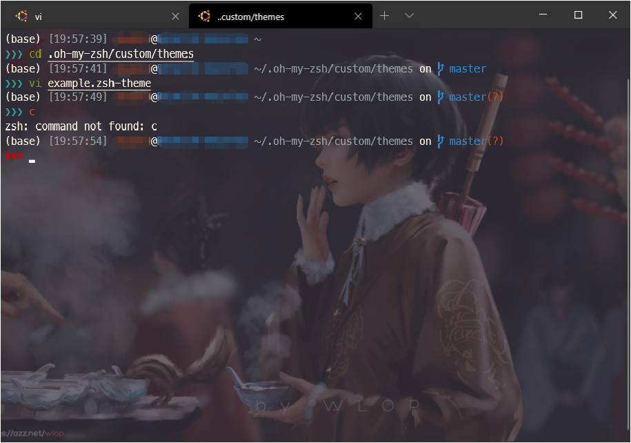

# 一个zsh主题

效果图如下所示:



> **终端**: Windows Terminal, **字体**: Meslo LG M for powerLine, **终端配色**: Solarized Dark

## 特性

- 当前时间
- 当前用户名与机器名
- 当前工作目录
- 当前git分支
- git状态，只有dirty的表示：`(?)`
- 上次命令的执行状态，成功：`>>>`，失败：`xxx`

## 安装

克隆仓库到主题目录：

```zsh
git clone https://github.com/DENGQUANXIN/mnzsh.git $ZSH_CUSTOM/themes/
```

在`.zshrc`中设置`ZSH_THEME="mnzsh"`
